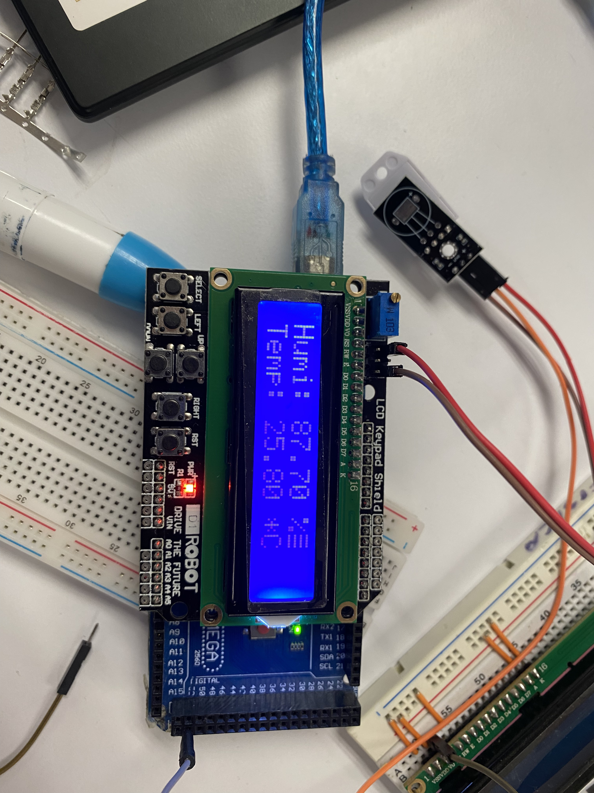

# Estación Meteorológica con Arduino, LCD y Sensor DHT11 (Versión 2)

Este proyecto utiliza un Arduino junto con un sensor de temperatura y humedad DHT11 para mostrar los valores en un display LCD 16x2. El sistema actualiza las mediciones cada 2 segundos y maneja errores de lectura del sensor.

## Novedades en las Versiones
- **Versión 2**: Se agregaron la medición de los botones de la LCD Shield y los valores que en ella se tomaron.
- **Versión 3**: Se implementó que, por medio de los botones, la información de la LCD fuera cambiando y mostrando otros datos.
- **Versión 4**: Se mejoró la lógica de los botones para que mostraran de una mejor manera los valores que ellos obtenían.

## Componentes Necesarios
- Arduino (Uno, Mega, Nano, etc.)
- Pantalla LCD 16x2 con interfaz paralela
- Sensor DHT11
- LCD Shield con botones
- Potenciómetro (para ajustar el contraste del LCD)
- Resistencias y cables de conexión

## Conexión del Hardware

| Componente | Pin en Arduino |
|------------|---------------|
| LCD RS     | 8             |
| LCD E      | 9             |
| LCD D4     | 4             |
| LCD D5     | 5             |
| LCD D6     | 6             |
| LCD D7     | 7             |
| DHT11 Data | 2             |
| Botones LCD Shield | A0  |

## Instalación y Uso
1. Clona este repositorio o descarga el archivo.
2. Asegúrete de tener instaladas las siguientes bibliotecas en el IDE de Arduino:
   - `LiquidCrystal`
   - `DHT` (de Adafruit)
3. Conecta los componentes según la tabla de conexiones.
4. Sube el código al Arduino.
5. Observa los valores en la pantalla LCD y utiliza los botones para cambiar la información mostrada.

## Capturas de Pantalla
#Version 2

#Version 3

#Version 4

